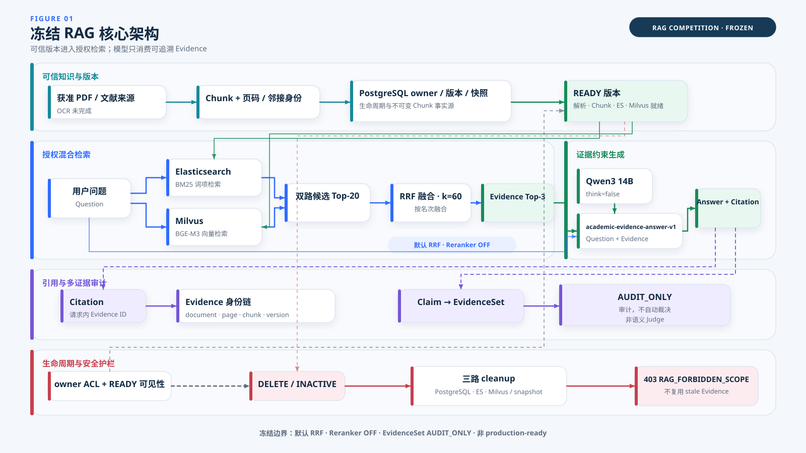
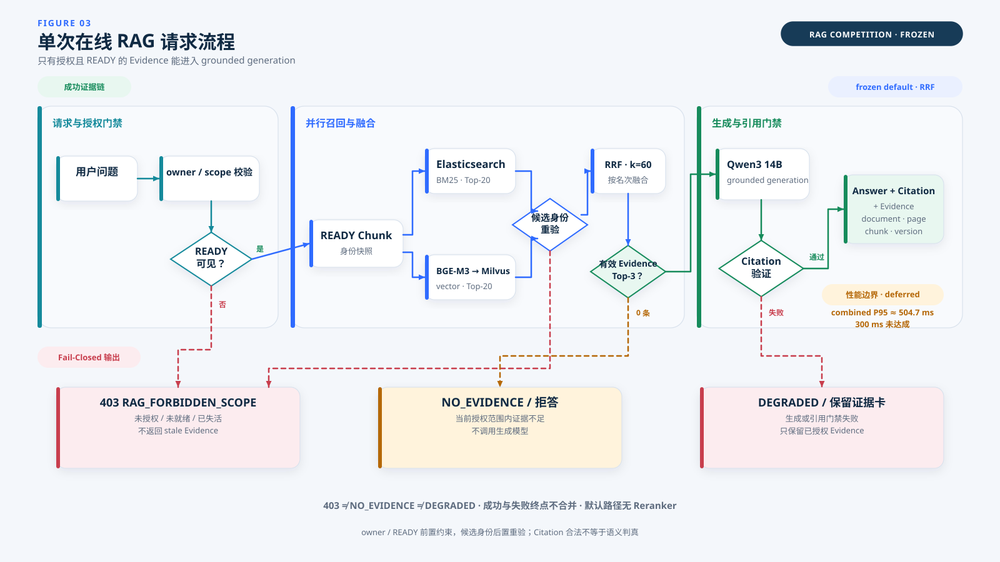
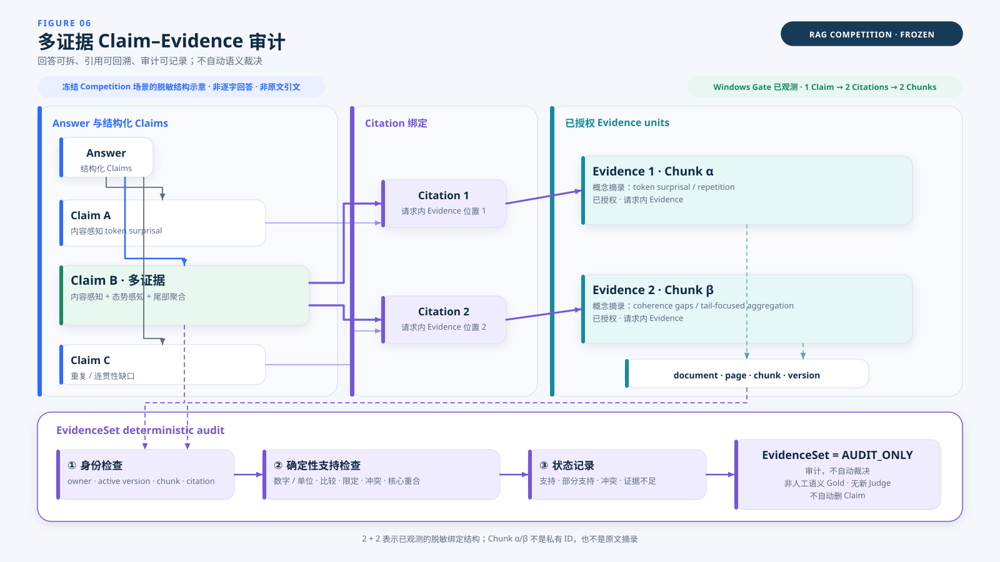
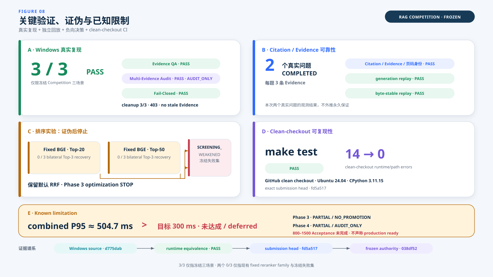

# RAG 模块技术报告草案

> 本稿用于后续集成到正式比赛技术报告。文中“已验证”仅指所列冻结 Gate 与证据范围；设计事实、真实运行结果、CI 结果、历史 Gate、screening 结果和已知限制分别记账。

## 1. RAG 模块目标与设计原则

本项目面向个人学术文献问答。与开放域聊天不同，其关键约束不是尽可能扩大模型可用上下文，而是明确回答所依据的文献是否获得当前用户授权、版本是否仍然有效、引用能否回溯到原始位置，以及文献删除后旧证据是否会继续进入回答。因此，RAG 模块以“可信知识进入、证据约束生成、引用可追溯、生命周期失败关闭”为主要设计目标。

第一项原则是**事实源单一**。PostgreSQL 保存 owner、document、version、生命周期与不可变 Chunk 快照，是在线可见性的权威来源；Elasticsearch 与 Milvus 提供检索能力，但不独立决定授权或版本有效性。这样可以避免数据库、词项索引与向量索引分别形成互相矛盾的权限结论。

第二项原则是**最小授权上下文**。在线生成模型只消费当前请求内、通过 owner ACL 与 READY 门禁、并在检索后完成身份重验的 Evidence。模型不直接访问整个语料库，也不能通过客户端参数扩大服务端授权范围。

第三项原则是**可追溯输出**。Answer 中的 Citation 必须映射到本次 Evidence，并保留 document、page、chunk 与 version 身份。引用合法性不等同于回答语义必然正确，但它把后续人工核验从“相信一段文本”转化为“检查具体证据位置”。

第四项原则是**失败关闭**。无证据、越权/未就绪/失活，以及生成或 Citation 门禁失败具有不同语义，系统分别返回 `NO_EVIDENCE`、`403 RAG_FORBIDDEN_SCOPE` 与 `DEGRADED`，而不是在不确定时强行生成。

第五项原则是**证据决定复杂度**。系统验证过固定 Reranker，但没有因组件更复杂而默认启用。冻结失败集上的 Top-20 与 Top-50 screening 均未恢复目标案例，因此默认路径保持 RRF，性能与质量债务按实证单独保留。

图 01 建议置于本节末或第 2 节开头，先给出可信版本、在线检索、生成、审计和生命周期的总体关系。



**图 01｜冻结 RAG 核心架构。** 获准文献形成 owner-scoped 的版本化 Chunk，并在 PostgreSQL、Elasticsearch 与 Milvus 一致就绪后进入 READY；在线问题经 BM25 与 BGE-M3 双路召回、默认 RRF 融合和 Qwen 证据约束生成，Citation 可回溯到 document/page/chunk/version。EvidenceSet 仅作确定性 `AUDIT_ONLY`，删除后通过失活、三路 cleanup 和 403 失败关闭。图中同时保留 OCR 未完成、Reranker OFF 与非 production-ready 边界。

## 2. 数据与知识版本管理

知识进入 RAG 前先转化为 owner-scoped 的文档与版本实体，而不是直接写入一个无版本索引。内容变化会创建新的 `document_version_id`；Chunk 快照绑定稳定的 document/version/page/chunk 身份。该设计的原因是学术文献可能被重新上传、替换、删除或撤权，如果只按文件名或外部 ID 查询，旧索引结果可能在版本变化后继续被召回。

版本只有在解析、Chunk、Elasticsearch 与 Milvus 全部就绪且未删除、未过期时才能进入 `READY`。因此，READY 不是“文件上传成功”的同义词，而是双索引与事实源一致性的发布状态。在线请求从 PostgreSQL 解析 READY 版本，再加载对应的不可变 Chunk 快照并校验唯一身份；任一事实源、物理路由或活动状态无法证明时，系统失败关闭。

PostgreSQL 的事实源角色还用于生命周期控制。删除或失效时，系统先提交 `INACTIVE`，立即切断在线可见性，再异步执行 Elasticsearch、Milvus 与 runtime snapshot 的物理 cleanup。先失活、后清理可以避免清理窗口中旧内容仍被视为有效知识；物理 cleanup 的失败也不能重新激活事实源。

当前边界是：持久化 PDF/Chunk、READY、双索引与 cleanup 已有冻结证据，但 OCR 与正式 MinIO 应用适配尚未完成，目标规模性能与生产运维也未验收。技术报告不得将 MVP 文件对象后端或已验证闭环写成完整生产数据平台。

## 3. 混合检索与融合策略

在线检索使用 Elasticsearch/BM25 与 Milvus/BGE-M3 两个并行通道。BM25 对论文术语、缩写、方法名和精确词项具有直接优势；BGE-M3 向量检索用于处理语义改写与表述差异。保留双路的目的不是假设融合一定优于每个单路，而是让两类互补信号进入同一冻结候选合同，并通过真实结果决定后续策略。

当前冻结参数为：每个通道最多返回 20 个候选，RRF 参数 `k=60`，最终选择 `Evidence Top-3`。融合仅使用两个通道的排名，不直接比较 BM25 与 COSINE 原始分数，因为两类分数不具备天然可比尺度。候选进入融合前后均受 owner/document/version/active 身份检查约束。

默认策略为 RRF，Reranker 为可选、非默认组件。固定 BGE Reranker 曾在受控 `test=100` 指标上显示局部排序增益，但进一步在冻结 Phase 3 排序失败上进行 Top-20 与 Top-50 screening 时，两者都得到 `0/3 bilateral Top-3 recovery`。因此，当前证据不足以把该组件设为默认，最终决定是 `SCREENING_WEAKENED → keep default RRF → STOP Phase-3 ranking optimization`。

这一决定不表示所有 Reranker 或所有排序方法无效。screening 只约束当前 fixed reranker family、固定输入与冻结 3 条失败；未来只有在新的代表性负载反复证明候选集中已有所需 Evidence、最终 Top-k 系统性坍缩并造成实质 QA 失败时，才有条件重新打开独立 Gate。

## 4. 证据约束生成与引用追踪

融合后的最多 3 条有效 Evidence 与用户问题共同进入生成层。冻结生成配置为 Ollama `qwen3:14b`，模型 digest 已绑定；Prompt identity 为 `academic-evidence-answer-v1`，`thinking=false`，温度为 0。明确关闭 thinking 的目的不是追求特定文风，而是避免隐藏推理占用固定输出预算并影响结构化 Answer 合同。

生成层要求模型输出结构化 Claim，并为每个 Claim 提供一个或多个 citation_ids。Citation ID 必须落在本次请求的 Evidence 集合内；系统不接受越界引用。成功响应同时包含 Answer、Citation 与 Evidence，Evidence 继续携带 document、page、chunk、version 身份，从而支持原文定位与版本核验。

生成层使用三种互不混淆的失败语义。若检索后没有有效 Evidence，系统返回 `NO_EVIDENCE`，并且不调用真实生成模型；这样可以减少模型在空证据条件下编造答案的机会。若 owner/scope、READY、活动状态或候选身份无法证明，系统返回 `403 RAG_FORBIDDEN_SCOPE`。若 Evidence 已授权但生成或 Citation 门禁失败，则返回 `DEGRADED`，不交付未经验证的 Answer，只保留已授权证据卡。

图 03 建议置于本节中部，在解释三种失败语义之前，用一次请求的时间顺序说明前置授权、并行召回、身份重验、生成与终态分流。



**图 03｜单次在线 RAG 请求流程。** 请求先经过服务端 owner/scope 与 PostgreSQL READY 门禁，再由 Elasticsearch BM25 与 Milvus/BGE-M3 并行召回、RRF 融合 Top-3 Evidence，最后由 Qwen 生成并验证 Citation。无证据、越权/失活、生成/引用门禁失败分别进入 `NO_EVIDENCE`、403 与 `DEGRADED` 路径。`403 ≠ NO_EVIDENCE ≠ DEGRADED`，Citation 合法也不等于语义自动判真。

## 5. Claim–Evidence 与 Multi-Evidence 审计

仅提供 Citation 列表仍不足以说明回答内部每个判断由哪些证据支持。为此，生成输出被拆分为结构化 Claim，每个 Claim 通过 citation_ids 绑定一条或多条请求内 Evidence。EvidenceSet 在不新增检索、不读取或修改 RRF 分数的前提下，对这些绑定进行确定性审计。

审计首先验证身份：owner、活动 document/version、Chunk 唯一身份与 Citation 位置必须一致。随后检查可以确定性表达的支持条件，包括数字、单位、比较对象、限定条件、关系、核心重合与同单位数值冲突。输出记录为支持、部分支持、冲突或证据不足。该状态用于暴露后续核验位置，而不是代替人工判断论文语义与 Claim 是否真实成立。

冻结 Competition 场景 `COMP-EVIDENCESET-001` 已在 Windows 真实 Gate 中通过，观察到至少一个真实生成 Claim 同时绑定多条 Citation 与多个 Chunk。比赛材料使用 `1 Claim → 2 Citations → 2 Chunks` 的脱敏结构表达，不展示私有问题、完整 Answer、真实 Chunk ID 或 Evidence 原文。

EvidenceSet 的强制边界为：`AUDIT_ONLY`、`human semantic Gold=false`、`new Judge=false`、`automatic claim deletion=false`。准确中文表述是“审计，不自动裁决”。审计失败不会自动删除 Claim、自动重写 Answer、重新检索或把确定性词面检查宣传为通用语义蕴含。

图 06 建议置于本节核心段落之后，使读者先理解 Claim/Citation/Evidence 身份，再观察多证据绑定与底部审计轨。



**图 06｜多证据 Claim–Evidence 审计。** 冻结 Competition 真实场景已观测到至少一个生成 Claim 同时绑定两条 Citation 和两个 Chunk；系统可沿 Citation 回溯 Evidence 身份，再执行 owner/活动版本与数字、比较、限定、冲突等确定性检查。图中的 Claim 文本与 Chunk α/β 为脱敏结构示意，EvidenceSet 仅为 `AUDIT_ONLY`。

## 6. 权限、生命周期与失败关闭

权限判断由服务端认证 owner 与请求 scope 共同约束，客户端只能收窄范围，不能提供可信 ACL 结论。在线请求在检索前解析授权 READY 版本，在候选产生后再次验证 owner、document、version 与 active 身份。前后两次检查分别控制“哪些版本可以检索”和“实际候选是否仍然属于这些版本”，用于抵御请求处理期间的版本漂移。

`NO_EVIDENCE` 与 403 的语义必须分开：前者表示请求范围合法，但当前授权范围没有足够证据；后者表示未授权、未 READY、已失活或范围无法证明。生成/引用失败则使用 `DEGRADED`。将三种状态合并为通用失败会丢失安全与产品语义，也会让演示无法说明系统何时拒答、何时禁止访问、何时仅保留证据卡。

生命周期验证由 `COMP-FAIL-CLOSED-001` 覆盖。同一隔离版本先用于两个真实学术问题，随后执行 DELETE。冻结结果记录 cleanup job `3/3`、runtime snapshot cleanup、inactive visibility、Answer API `403 RAG_FORBIDDEN_SCOPE`、Evidence 返回 0 与 `stale_evidence_reused=false`。这说明系统不仅能在应答时返回证据，也能在知识不应继续使用时停止回答。

该证据只证明既有 owner/READY/DELETE 生命周期合同，不应外推为覆盖所有安全威胁、所有删除异常或完整生产安全验收。

## 7. 评测设计与关键实验

评测策略区分设计事实、结构校验、真实运行与正式人工判断。Fixture/Fake 只用于合同和工具结构测试，不作为 Competition 场景结果。历史 3 文档 9 问题真实 Gate 可说明已有学术问答链路，但不能替代当前 Competition reproduction。冻结 Competition baseline 只有在 Windows 真实运行、脱敏结果独立 closeout 与 exact-head clean-checkout CI 同时完成后才成立。

当前关键结果包括：

- 三个冻结 Competition 场景 `3/3 PASS`；
- 两个真实学术问题均 `COMPLETED`，每题 3 条 Evidence；
- Citation/Evidence/页码身份、generation replay 与本次 byte-stable replay 通过；
- DELETE 后 cleanup `3/3`、403 与 no-stale Evidence 通过；
- fixed BGE Reranker Top-20 与 Top-50 screening 均为 `0/3 bilateral Top-3 recovery`；
- GitHub clean checkout 在 Ubuntu 24.04 / CPython 3.11.15 上 `make test PASS`；
- historical clean-checkout runtime/path errors 从 14 降为 0。

其中 `3/3` 只表示三个事先冻结场景，不是准确率；`0/3` 只约束当前 fixed reranker family 与冻结失败集；`14→0` 只指 clean-checkout runtime/path errors，不是全部产品缺陷。

图 08 建议置于本节末，用四个证据块与一条 limitation rail 汇总成功、证伪、可复现性和未达成指标。



**图 08｜冻结 baseline 的关键验证与负向决策。** Windows 真实复现、Citation/回放门禁、Reranker 负向 screening 与 clean-checkout CI 共同支撑当前路线。combined P95 约 504.7 ms，高于 300 ms 目标，明确记录为未达成、deferred。

## 8. 真实 Competition Gate

Competition Pack 固定恰好三个场景。`COMP-QA-001` 用于验证 Evidence-grounded QA：冻结 dossier 要求回答包含 MAX-composite step-risk 的定义及其保留局部尖锐失效的原因，并将 Citation 定位到授权文档 page 4。Windows 结果为 `PASS / COMPLETED`，返回 3 条 Evidence，Citation/Evidence/页码身份与回放门禁通过。确定性位置门禁通过不替代人工对答案语义的最终判断。

`COMP-EVIDENCESET-001` 用于验证 Multi-Evidence Audit：答案点涉及 content-aware token surprisal、重复/连贯性缺口指标与 tail-focused aggregation，授权页范围为 page 1–3。结果为 `PASS / COMPLETED`，至少两条 Evidence，且至少一个生成 Claim 形成多 Evidence 绑定。该场景证明结构可观测，但 EvidenceSet 仍为 `AUDIT_ONLY`。

`COMP-FAIL-CLOSED-001` 在同一隔离生命周期完成 DELETE 后执行。结果为 `actual_refusal=true`、HTTP 403、`RAG_FORBIDDEN_SCOPE`、Evidence 0、`stale_evidence_reused=false`，并要求 cleanup 3/3、snapshot cleanup 与 inactive visibility 全部通过。该场景的意义是验证知识生命周期终点，而不是泛化安全攻击覆盖率。

真实运行使用 Windows PowerShell 5.1 版本化 wrapper，源提交为 `d775dab706c2a05d5b838f644b77b257961a4549`，Run ID 为 `competition_v1_20260809_01`。独立 closeout 将 submission repository head 冻结为 `fd5a517b56ba619ca461e262a5ea1a8ac8b9ac7b`，并确认 `d775dab → fd5a517` runtime equivalence 为 PASS。必须使用上述三身份，不得写成“Windows 复现了 fd5a517”。

私有问题、完整 Answer、完整 Evidence/Chunk、PDF、数据库/索引内容与连接信息不进入公开材料。场景展示只使用已批准的脱敏问题、答案点、页码、结构关系和结果摘要。

## 9. 可复现性

本项目将“Windows 真实复现”“submission 仓库状态”和“CI clean checkout”分开记录。Windows 复现证明目标用户环境能够执行真实 PostgreSQL READY、Elasticsearch、Milvus、RRF、Qwen、Citation、EvidenceSet 与 cleanup 主链；submission head 证明后续差异不改变 Competition runtime 语义；GitHub clean checkout 证明精确提交在 Ubuntu 24.04 / CPython 3.11.15 上可以完成 `make test`。

完整谱系为：

```text
Windows reproduction source = d775dab
runtime equivalence = PASS
submission repository head = fd5a517
baseline authority closeout = 038df52
visual specification = 7818f33
visual rendering = c2de741
```

clean-checkout 历史 runtime/path errors 为 `14→0`。该指标说明 ignored runtime 依赖和路径问题已从 CI 环境中移除，不代表产品质量、问答质量或全部缺陷清零。

真实运行产物默认留在 ignored runtime。公开交付只允许脱敏的 scenario/run/source/model identity、Answer 展示副本与哈希、Citation、位置身份、每条 Evidence 最多 240 字符摘录与哈希、EvidenceSet `AUDIT_ONLY` 记录及 cleanup 证明。完整内容公开前仍需 owner 做论文许可与脱敏复核。

## 10. 已知局限与适用边界

第一，性能目标尚未达到。Windows 分段 profile 的 combined P95 约为 `504.7 ms`，高于 `300 ms` 目标；该指标必须标记为 `NOT ACHIEVED / DEFERRED`。历史归因显示 Query Embedding 与 READY 路由解析是主要成本，但本报告不新增性能实验或优化结论。

第二，Reranker 不属于默认路径。当前 fixed reranker family 在冻结三条排序失败上的 Top-20 与 Top-50 screening 均为 0/3；因此保留 RRF，并停止当前 Phase 3 retrieval/ranking optimization。该结论不否定所有 Reranker 或未来条件式方案。

第三，阶段完成度有限。Phase 3 为 `PARTIAL / NO_PROMOTION`，工作流关闭不等于达到稳定净增益的退出条件；Phase 4 已完成确定性 Multi-Evidence 审计核心，但整体仍为 `PARTIAL / AUDIT_ONLY`，pair-level 人工 Gold、新 NLI/LLM Judge 与在线硬裁决后置。

第四，正式验收与用户评价未完成。800–1500 条正式独立 Acceptance 尚未进入，真实用户评价状态为 `PENDING_REAL_USER_EVALUATION`。当前只提供双评审与仲裁协议，不提供用户数量、满意度、准确率、时间节省、acceptance score、Cohen's kappa 或用户引语。需要在集成表面预留时，写明 `[待真实用户评价完成后填入]`。

第五，OCR、正式 MinIO、目标规模性能、生产监控、前端、Agent API、阶段 5 复杂问答等未完成或不在冻结 baseline。Competition RAG owner scope 的 `DONE_ENOUGH` 仅表示当前比赛 RAG 内容责任范围已具备足够证据，不表示系统 production ready。

综上，当前证据支持的准确结论是：系统已形成一条冻结、可追溯、会拒答、可清理并经过真实 Competition Gate 的 RAG Core；不支持“自动消除幻觉”“准确率 100%”“300 ms 已达成”或“production ready”。

## 参考的仓库权威

- [`rag_competition_baseline.json`](../../machine/competition/rag_competition_baseline.json)
- [`rag-competition-pack-v1.json`](../../machine/competition/rag-competition-pack-v1.json)
- [`RAG_COMPETITION_HANDOFF_V1.md`](RAG_COMPETITION_HANDOFF_V1.md)
- [`REQUIREMENTS_TRACEABILITY.md`](../REQUIREMENTS_TRACEABILITY.md)
- [`PRODUCT_DECISIONS.md`](../PRODUCT_DECISIONS.md)
- [`VISUAL_EVIDENCE_LEDGER.md`](visuals/VISUAL_EVIDENCE_LEDGER.md)
- [`RAG_COMPETITION_CLAIMS_LEDGER.md`](RAG_COMPETITION_CLAIMS_LEDGER.md)
