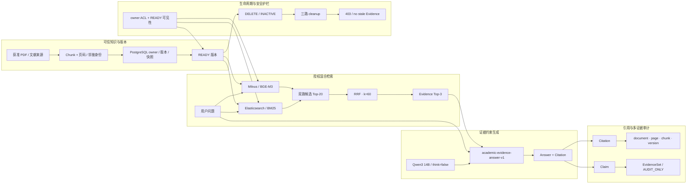

# 01-system-architecture — 绘图规格

Spec ID：`01-system-architecture`

用途：比赛 PPT、技术报告、答辩和仓库文档

性质：绘图就绪的信息架构规格，不是最终 SVG/PPT

共同证据账本：[`VISUAL_EVIDENCE_LEDGER.md`](VISUAL_EVIDENCE_LEDGER.md)

## 1. Figure objective

用一张分层架构图说明：系统以可信文档版本为起点，经 owner/READY 约束的 ES+Milvus
混合检索、默认 RRF 和证据约束生成，输出可回溯 Citation，并由生命周期清理与
EvidenceSet 审计提供外围控制。

## 2. Audience takeaway

评委在 10 秒后应记住：**这不是“把问题直接交给大模型”，而是“可信版本 → 授权检索
→ RRF Top-3 Evidence → Qwen Claim/Citation → 可追溯与可清理”的证据链。**

## 3. Canvas / hierarchy

- 画布：16:9 横向；建议内容安全区 14.8:8.0。
- 阅读方向：左到右为在线主链；上到下为“可信知识”“在线问答”“证据审计”“生命周期”。
- 层级：4 条水平带。第一带提供 READY 数据基础；第二带是视觉最强的主链；第三带是
  Citation/Evidence 审计链；第四带是贯穿全图的生命周期/安全护栏。
- 主链同时接收“用户问题”和“READY 版本”两个输入；不要把入库链画成一次问答请求
  内同步发生的步骤。
- 主要节点控制在 18 个以内；Reranker 不进入主链。

## 4. Major groups

| Group ID | Exact group name | Role |
|---|---|---|
| G-A | 可信知识与版本 | 说明获准来源、Chunk、PostgreSQL owner/版本事实源和 READY 条件 |
| G-B | 授权混合检索 | 说明 ES/Milvus 双路、候选集合、RRF 和 Top-3 Evidence |
| G-C | 证据约束生成 | 说明固定 Qwen/Prompt 接收问题与 Evidence，产出 Answer/Citation |
| G-D | 引用与多证据审计 | 说明 Citation 的位置/版本追踪和 Claim→EvidenceSet 审计 |
| G-E | 生命周期与安全护栏 | 说明 ACL、INACTIVE、三路清理和 403 fail-closed |

## 5. Nodes

| ID | Display label | Technical meaning | Importance | Parent group | Evidence |
|---|---|---|---|---|---|
| A01 | 获准 PDF / 文献来源 | 只表示已获准进入个人库的来源；不表示完整 OCR 生产链 | primary | G-A | 01-E02, 01-E18 |
| A02 | Chunk + 页码 / 邻接身份 | 带 document/version/page/neighbor 等稳定身份的 Chunk 快照 | primary | G-A | 01-E02, 01-E14 |
| A03 | PostgreSQL owner / 版本 / 快照 | owner、文档版本、生命周期和不可变 Chunk 快照的事实源 | primary | G-A | 01-E02, 01-E03 |
| A04 | READY 版本 | 解析、Chunk、ES、Milvus 均就绪且未失活的可见版本 | primary | G-A | 01-E03, 01-E05 |
| B00 | 用户问题 | 在线问答的自然语言输入 | primary | G-B | structural |
| B01 | Elasticsearch · BM25 | READY 路由下的词项检索通道 | primary | G-B | 01-E06, 01-E08 |
| B02 | Milvus · BGE-M3 | READY 路由下的向量检索通道；BGE-M3 生成查询向量 | primary | G-B | 01-E07, 01-E08 |
| B03 | 双路候选 Top-20 | 每个检索通道的冻结候选边界 | primary | G-B | 01-E09 |
| B04 | RRF 融合 · k=60 | 仅按排名融合异构检索结果；冻结默认路径保持 RRF | primary | G-B | 01-E09, 01-E10, 01-E11 |
| B05 | Evidence Top-3 | 进入生成层的最多 3 条已授权证据 | primary | G-B | 01-E09 |
| C01 | Qwen3 14B | 固定真实生成模型；`think=false` | primary | G-C | 01-E12 |
| C02 | academic-evidence-answer-v1 | 只依据 Evidence 生成结构化 Claim 的固定 Prompt | primary | G-C | 01-E12, 01-E13 |
| C03 | Answer + Citation | 完成回答并保留请求内 Citation 映射 | primary | G-C | 01-E13, 01-E14 |
| D01 | Citation | 回答中的引用位置，映射到 Evidence ID | audit | G-D | 01-E14 |
| D02 | Evidence 身份链 | `document → page → chunk → version` 可追溯字段 | audit | G-D | 01-E14 |
| D03 | Claim → EvidenceSet | 一个 Claim 对应一条或多条已授权 Evidence | audit | G-D | 01-E15 |
| D04 | AUDIT_ONLY | 确定性审计，不是语义 Judge，不自动裁决 | audit | G-D | 01-E15 |
| E01 | owner ACL + READY 可见性 | 服务端授权范围与活动版本共同决定可见性 | secondary | G-E | 01-E04, 01-E05 |
| E02 | DELETE / INACTIVE | 先使版本失活，再执行物理清理 | failure | G-E | 01-E16 |
| E03 | 三路 cleanup | PostgreSQL 任务协调下清理 ES、Milvus、runtime snapshot | failure | G-E | 01-E16, 01-E17 |
| E04 | 403 RAG_FORBIDDEN_SCOPE | 未授权、未就绪或失活版本失败关闭，不复用 stale Evidence | failure | G-E | 01-E17 |

## 6. Edges

| Source | Target | Label | Direction | Type |
|---|---|---|---|---|
| A01 | A02 | 解析 / 切分 | left-to-right | primary |
| A02 | A03 | 写入身份与快照 | left-to-right | primary |
| A03 | A04 | 双索引就绪后发布 | left-to-right | primary |
| A04 | B01 | READY 路由 + 授权 Chunk | top-to-bottom | primary |
| A04 | B02 | READY 路由 + 授权 Chunk | top-to-bottom | primary |
| B00 | B01 | 原问题 / 词项表示 | left-to-right | primary |
| B00 | B02 | 原问题 / BGE-M3 查询向量 | left-to-right | primary |
| B01 | B03 | BM25 candidates | left-to-right | primary |
| B02 | B03 | vector candidates | left-to-right | primary |
| B03 | B04 | rank lists | left-to-right | primary |
| B04 | B05 | 取融合 Top-3 | left-to-right | primary |
| B00 | C02 | Question | left-to-right | primary |
| B05 | C02 | Retrieved Evidence | left-to-right | primary |
| C01 | C02 | 固定模型身份 | top-to-bottom | primary |
| C02 | C03 | grounded generation | left-to-right | primary |
| C03 | D01 | 引用编号 | top-to-bottom | audit |
| D01 | D02 | 映射与定位 | left-to-right | audit |
| C03 | D03 | 结构化 Claim | top-to-bottom | audit |
| D03 | D04 | deterministic audit | left-to-right | audit |
| E01 | A04 | 约束可见版本 | bottom-to-top | secondary |
| E01 | B01 | 约束候选 | bottom-to-top | secondary |
| E01 | B02 | 约束候选 | bottom-to-top | secondary |
| A04 | E02 | DELETE / 过期 | top-to-bottom | fail-closed |
| E02 | E03 | 失活后清理 | left-to-right | fail-closed |
| E03 | E04 | 清理 + 不可见性证明 | left-to-right | fail-closed |

## 7. Visual emphasis

- **Primary path：** 用最强视觉权重串联 `READY → ES ∥ Milvus → RRF → Top-3 → Qwen
  → Answer + Citation`。双路检索必须在相同水平位置并行，汇合后只保留一个 RRF。
- **Secondary path：** 入库带与 owner/ACL 护栏使用次一级权重；它们解释主链的可信输入，
  但不抢夺在线问答焦点。
- **Audit path：** Citation/EvidenceSet 使用独立的细实线或侧向支线；`AUDIT_ONLY` 必须
  与 EvidenceSet 同框，不得放在脚注中。
- **Failure path：** `DELETE / INACTIVE → cleanup → 403` 使用明确的终止方向；不得画回
  生成主链，也不得暗示被删版本仍可回答。
- **Optional component：** 默认不画 Reranker。若版面必须交代，只能在图外注记：
  `Reranker：可选 / 默认 OFF / frozen screening weakened`，且不得连接主路径。

## 8. Text content

图内只使用以下短文本；可换行，不扩写成长段：

```text
可信知识与版本
获准 PDF / 文献来源
Chunk + 页码 / 邻接身份
PostgreSQL owner / 版本 / 快照
READY 版本

授权混合检索
用户问题
Elasticsearch
BM25 词项检索
Milvus
BGE-M3 向量检索
双路候选 Top-20
RRF 融合 · k=60
Evidence Top-3
默认 RRF · Reranker OFF

证据约束生成
Qwen3 14B
academic-evidence-answer-v1
think=false
Answer + Citation

引用与多证据审计
Citation
document · page · chunk · version
Claim → EvidenceSet
AUDIT_ONLY
审计，不自动裁决

生命周期与安全护栏
owner ACL + READY 可见性
DELETE / INACTIVE
三路 cleanup
PostgreSQL · Elasticsearch · Milvus / snapshot
403 RAG_FORBIDDEN_SCOPE
不复用 stale Evidence
```

不在图内放 model digest、完整 commit SHA、服务版本或长解释；它们留给图注/讲稿/证据
账本。

## 9. Caption

**图 01｜冻结 RAG 核心架构。** 获准文献先形成 owner-scoped 的版本化 Chunk，并在
PostgreSQL、Elasticsearch 与 Milvus 一致就绪后进入 READY；在线问题经 BM25 与
BGE-M3 双路召回、默认 RRF 融合和 Qwen 证据约束生成，Citation 可回溯到文档、页码、
Chunk 与版本。EvidenceSet 仅作确定性 `AUDIT_ONLY`，删除后通过失活、三路清理和 403
失败关闭。

## 10. Speaker notes

- PostgreSQL 是 owner、版本和生命周期事实源；READY 不是“文件上传成功”的同义词。
- 在线主链使用 ES BM25 与 Milvus/BGE-M3 双路候选，冻结参数为 Top-20、RRF `k=60`、
  生成 Evidence Top-3。
- Qwen 只接收已授权 Evidence，输出结构化 Claim 与 Citation；Citation 可定位到
  document/page/chunk/version。
- Reranker 没有进入默认路径；冻结 baseline 保持默认 RRF。
- EvidenceSet 是确定性审计轨，不是人工语义 Gold、在线 Judge 或“自动消除幻觉”。

## 11. Claim boundary

演示者不得从本图推断或说出：

- “OCR 已形成生产完整链路”；当前 OCR 仍未完成。
- “Reranker 已在线默认启用”或“Top-50 已证明更优”；默认是 RRF，Reranker 为 OFF。
- “EvidenceSet 自动判定事实真伪、删除错误 Claim 或消除幻觉”；它是 `AUDIT_ONLY`。
- “403 覆盖一切故障场景”；冻结实证是特定 owner/READY/DELETE 生命周期的失败关闭。
- “系统已达到 300 ms”或“production ready”；性能目标未达成，正式 Acceptance 未完成。
- “含 Agent 编排、会话记忆、在线 NLI Judge、生产监控”；这些不在冻结 baseline 中。

## 12. Structural draft

仅用于验证信息架构，不作为最终图形：



## 13. Evidence mapping

本规格的全部技术节点、边和数值分别映射到共享账本 `01-E01`～`01-E18`。其中
`A01` 的 OCR 限制、`B04` 的默认 RRF、`D04` 的 `AUDIT_ONLY`、`E04` 的 403/no-stale
边界必须随图保留，不能在美术精简时删除。
