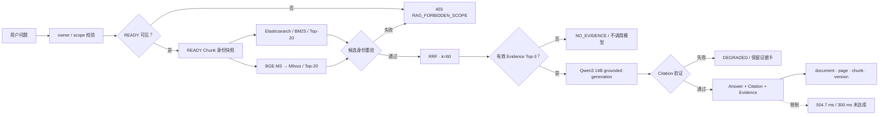

# 03-online-rag-pipeline — 绘图规格

Spec ID：`03-online-rag-pipeline`

用途：解释用户提问后的单次在线处理顺序

性质：流程/判定图，不重复系统架构图

共同证据账本：[`VISUAL_EVIDENCE_LEDGER.md`](VISUAL_EVIDENCE_LEDGER.md)

## 1. Figure objective

以单次请求为时间轴，展示 owner/READY 校验、双路召回、RRF、Qwen 生成、Citation
验证与三类失败关闭输出。

## 2. Audience takeaway

评委在 10 秒后应记住：**只有授权且 READY 的证据能进入生成；没有证据就拒答，范围
非法就 403，生成/引用门禁失败就降级保留证据卡。**

## 3. Canvas / hierarchy

- 画布：16:9 横向。
- 阅读方向：左到右的单次请求序列；中心主线只放 8 个阶段。
- 分支布局：ES 与 Milvus 在中段上下并行；三条失败关闭路径统一落到画布下方的
  “Fail-Closed 输出带”。
- 成功路径落到右上；失败路径落到右下，二者不得在终点重新合并。
- 顶部小标题写“成功证据链”，底部小标题写“失败关闭”；不画入入库过程和 cleanup
  细节，避免与图 01 重复。

## 4. Major groups

| Group ID | Exact group name | Role |
|---|---|---|
| G-P1 | 请求与授权门禁 | 用户问题、owner/scope 校验和 READY 可见性判定 |
| G-P2 | 并行召回与融合 | 词项/向量表示、ES/Milvus 双路候选、RRF 与 Top-3 |
| G-P3 | 生成与引用门禁 | Qwen 证据约束生成、Citation 合法性和成功输出 |
| G-P4 | Fail-Closed 输出 | 403、NO_EVIDENCE、DEGRADED 三个互不混淆的终点 |
| G-P5 | 输出追溯 | 成功输出的 document/page/chunk/version 身份字段 |

## 5. Nodes

| ID | Display label | Technical meaning | Importance | Parent group | Evidence |
|---|---|---|---|---|---|
| P01 | 用户问题 | 单次 Answer API 请求中的 question | primary | G-P1 | 03-E01 |
| P02 | owner / scope 校验 | 服务端认证 owner 与请求文档范围校验 | primary | G-P1 | 03-E01, 03-E02 |
| P03 | READY 可见？ | PostgreSQL 解析授权且活动的 READY 版本 | primary decision | G-P1 | 03-E02, 03-E03 |
| P04 | READY Chunk 身份快照 | 加载并验证 version/chunk 唯一身份 | primary | G-P2 | 03-E04 |
| P05 | Elasticsearch · BM25 | 原问题的词项检索；候选上限 20 | primary parallel | G-P2 | 03-E05, 03-E07 |
| P06 | BGE-M3 → Milvus | 查询向量与向量检索；候选上限 20 | primary parallel | G-P2 | 03-E05, 03-E07 |
| P07 | 候选身份重验 | 每条候选必须仍匹配 owner/document/version/active | primary decision | G-P2 | 03-E06 |
| P08 | RRF · k=60 | 按排名融合两个检索通道 | primary | G-P2 | 03-E07 |
| P09 | 有效 Evidence Top-3？ | 判断融合结果是否存在可用于回答的已授权 Evidence | primary decision | G-P2 | 03-E07, 03-E08 |
| P10 | Qwen3 14B grounded generation | 基于 Evidence 生成一个或多个带 citation_ids 的 Claim | primary | G-P3 | 03-E10 |
| P11 | Citation 验证 | 引用编号必须落在本次 Evidence 集合内 | primary decision | G-P3 | 03-E11 |
| P12 | Answer + Citation + Evidence | 成功的 evidence-grounded response | primary terminal | G-P3 | 03-E13 |
| F01 | 403 RAG_FORBIDDEN_SCOPE | 未授权、未 READY、失活或事实源无法证明范围 | failure terminal | G-P4 | 03-E02, 03-E14 |
| F02 | NO_EVIDENCE / 拒答 | 当前授权范围没有足够证据；不调用 Qwen | failure terminal | G-P4 | 03-E08, 03-E09 |
| F03 | DEGRADED / 保留证据卡 | 真实生成或 Citation 门禁无法通过，回答失败关闭但保留授权证据 | failure terminal | G-P4 | 03-E12 |
| T01 | document · page · chunk · version | Citation/Evidence 的可追溯身份 | audit | G-P5 | 03-E13 |
| L01 | 300 ms 未达成 / deferred | 性能限制标记，不参与成功判定 | limitation | G-P5 | 03-E15 |

## 6. Edges

| Source | Target | Label | Direction | Type |
|---|---|---|---|---|
| P01 | P02 | 请求 | left-to-right | primary |
| P02 | P03 | 收窄后的 scope | left-to-right | primary |
| P03 | P04 | 是：授权且 READY | left-to-right | primary |
| P03 | F01 | 否：未授权 / 未就绪 / 不可验证 | down-right | fail-closed |
| P04 | P05 | 原问题 + 授权 Chunk | right-and-up | primary |
| P04 | P06 | 原问题 + 授权 Chunk | right-and-down | primary |
| P05 | P07 | BM25 candidates | left-to-right | primary |
| P06 | P07 | vector candidates | left-to-right | primary |
| P07 | P08 | 身份一致 | left-to-right | primary |
| P07 | F01 | 身份漂移 / 非活动 | down-right | fail-closed |
| P08 | P09 | 融合 Top-3 | left-to-right | primary |
| P09 | P10 | 是：有有效 Evidence | left-to-right | primary |
| P09 | F02 | 否：0 条有效 Evidence | down-right | fail-closed |
| P10 | P11 | Answer claims + citation_ids | left-to-right | primary |
| P11 | P12 | 通过 | left-to-right | primary |
| P11 | F03 | 失败 | down-right | fail-closed |
| P12 | T01 | 输出身份 | top-to-bottom | audit |
| P12 | L01 | 限制脚注 | top-to-bottom | secondary |

## 7. Visual emphasis

- **Primary path：** `用户问题 → scope → READY → ES∥Milvus → RRF → Evidence → Qwen
  → Citation 验证 → Answer` 使用连续、最醒目的箭头。
- **Parallel retrieval：** P05/P06 宽高一致、同级并列，避免误读为先 BM25 后向量检索。
- **Success path：** P12 是唯一成功终点，并直接带出 T01 的可追溯字段。
- **Failure path：** F01/F02/F03 必须是三个独立终点，分别标明 HTTP/Answer 状态：
  `403`、`200 + NO_EVIDENCE`、`200 + DEGRADED`（图面空间不足时可只保留状态词）。
- **Limitation：** `300 ms 未达成 / deferred` 放在输出侧小型限制标记中，不使用成功
  对勾或绿色达标语义。
- 不画 Reranker；该流程描述 frozen default path。

## 8. Text content

图内使用以下精确短文本：

```text
成功证据链
用户问题
owner / scope 校验
READY 可见？
READY Chunk 身份快照
Elasticsearch · BM25
BGE-M3 → Milvus
每路候选 Top-20
候选身份重验
RRF · k=60
有效 Evidence Top-3？
Qwen3 14B grounded generation
Citation 验证
Answer + Citation + Evidence
document · page · chunk · version

Fail-Closed 输出
403 RAG_FORBIDDEN_SCOPE
未授权 / 未就绪 / 已失活
NO_EVIDENCE / 拒答
当前授权范围内证据不足
不调用生成模型
DEGRADED / 保留证据卡
生成或引用门禁失败

性能边界
combined P95 ≈ 504.7 ms
300 ms 未达成 / deferred
```

不得把 `NO_EVIDENCE` 与 403 合并成一个“失败”框：前者表示授权范围内没有足够证据，
后者表示请求范围不可授权或不可证明。

## 9. Caption

**图 03｜单次在线 RAG 请求流程。** 请求先经过服务端 owner/scope 与 PostgreSQL READY
门禁，再由 Elasticsearch BM25 与 Milvus/BGE-M3 并行召回、RRF 融合 Top-3 Evidence，
最后由 Qwen 生成并验证 Citation。无证据、越权/失活、生成/引用门禁失败分别进入
`NO_EVIDENCE`、403 和 `DEGRADED` 失败关闭路径。

## 10. Speaker notes

- READY/owner 校验发生在检索之前，检索后还会重验候选身份，避免版本漂移。
- ES 和 Milvus 是并行通道，输出的是两个候选排名；RRF 不直接比较 BM25 与向量原始分数。
- 只有融合后的最多 3 条有效 Evidence 进入 Qwen，模型不能访问授权范围外的资料。
- `NO_EVIDENCE` 不调用模型；403 不返回旧 Evidence；生成失败则只保留已授权证据卡。
- 本图不声称 300 ms 已达成；冻结性能记录约为 `504.7 ms`，状态是 deferred。

## 11. Claim boundary

演示者不得从本图推断或说出：

- “所有问题都会生成回答”；无证据时系统明确拒答。
- “NO_EVIDENCE 等于权限错误”；两者状态和语义不同。
- “Citation 验证证明回答语义正确”；它证明引用编号和身份合法，不替代人工语义判断。
- “DEGRADED 仍是成功生成”；它表示真实生成门禁未通过，只保留证据卡。
- “在线流程使用默认 Reranker”；冻结默认路径是 RRF。
- “延迟达标、SLO 已验收或 production ready”；这些结论不成立。

## 12. Structural draft



## 13. Evidence mapping

流程事实映射到共享账本 `03-E01`～`03-E15`。渲染前必须逐一确认三条失败关闭路径、
Top-20/RRF 60/Top-3 参数和 `300 ms 未达成` 限制仍在；删除这些文字会改变技术语义。
