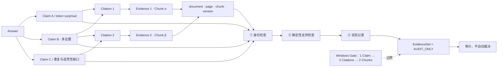

# 06-multi-evidence — 绘图规格

Spec ID：`06-multi-evidence`

用途：比赛核心技术差异点说明

性质：Claim–Citation–EvidenceSet 关系图；使用冻结场景的脱敏概念表达，不复刻私有回答

共同证据账本：[`VISUAL_EVIDENCE_LEDGER.md`](VISUAL_EVIDENCE_LEDGER.md)

## 1. Figure objective

说明生成回答可拆为结构化 Claim，每个 Claim 通过 Citation 绑定一个或多个已授权
Evidence/Chunk，并进入不改变检索的确定性 EvidenceSet 审计。

## 2. Audience takeaway

评委在 10 秒后应记住：**回答不是不可检查的文本块；冻结实证已观测到“1 个 Claim →
2 条 Citation → 2 个 Chunk”，但 EvidenceSet 只做确定性审计，不替代人工语义裁决。**

## 3. Canvas / hierarchy

- 画布：16:9 横向，三列一底栏。
- 阅读方向：左列“Answer / Claims” → 中列“Citations” → 右列“Evidence units”；底栏接收
  所有 Claim–Evidence 绑定，形成“EvidenceSet deterministic audit”。
- 重点层级：中间的多证据 Claim 使用最大节点；单证据 Claim 作为对照，尺寸较小。
- 示例必须加页眉：`冻结 Competition 场景的脱敏结构示意（非逐字回答 / 非原文引文）`。
- 不展示私有 question、完整 answer、真实 Chunk ID 或 Evidence 原文；使用 `Chunk α/β` 和
  “概念摘录”明确说明脱敏边界。

## 4. Major groups

| Group ID | Exact group name | Role |
|---|---|---|
| G-M1 | Answer 与结构化 Claims | 展示一个回答被拆分为可核验的 Claim |
| G-M2 | Citation 绑定 | 展示 Claim 使用一个或多个请求内 Citation |
| G-M3 | 已授权 Evidence units | 展示 Citation 到不同 Chunk 及其位置/版本身份 |
| G-M4 | EvidenceSet deterministic audit | 展示身份检查、确定性支持检查、状态记录和边界 |
| G-M5 | 实证与限制 | 展示 Windows Gate 观测结果及 `AUDIT_ONLY` 限制 |

## 5. Nodes

| ID | Display label | Technical meaning | Importance | Parent group | Evidence |
|---|---|---|---|---|---|
| M01 | Answer | Qwen 生成的回答容器；内部由一个或多个结构化 Claim 组成 | primary | G-M1 | 06-E01 |
| M02 | Claim A · 内容感知 token surprisal | 冻结场景允许答案点的脱敏单证据示例，不是逐字生成结果 | secondary | G-M1 | 06-E02 |
| M03 | Claim B · 多证据 | 脱敏概念：风险刻画同时涉及内容感知、态势感知与尾部聚合 | primary | G-M1 | 06-E02, 06-E03 |
| M04 | Claim C · 重复 / 连贯性缺口 | 冻结场景允许答案点的另一单证据示例 | secondary | G-M1 | 06-E02 |
| C01 | Citation 1 | 请求内 Evidence 位置 1 | primary | G-M2 | 06-E01 |
| C02 | Citation 2 | 请求内 Evidence 位置 2 | primary | G-M2 | 06-E01 |
| E01 | Evidence 1 · Chunk α | 脱敏概念摘录：content-aware token surprisal / repetition | primary | G-M3 | 06-E02, 06-E05 |
| E02 | Evidence 2 · Chunk β | 脱敏概念摘录：coherence gaps / tail-focused aggregation | primary | G-M3 | 06-E02, 06-E05 |
| E03 | document · page · chunk · version | 每个 Evidence unit 的可验证身份；不显示真实私有 ID | audit | G-M3 | 06-E06 |
| A01 | 身份检查 | owner、活动 document/version、Chunk 唯一身份、Citation 位置 | audit | G-M4 | 06-E06 |
| A02 | 确定性支持检查 | 数字/单位、比较对象、限定条件、关系、核心重合、冲突 | audit | G-M4 | 06-E07, 06-E09 |
| A03 | 审计状态记录 | 支持 / 部分支持 / 冲突 / 证据不足 | audit | G-M4 | 06-E08 |
| A04 | EvidenceSet = AUDIT_ONLY | 不自动删除 Claim，不作人工语义真值或新 Judge | primary boundary | G-M4 | 06-E11, 06-E12, 06-E13 |
| P01 | Windows Gate 已观测 | 冻结 `COMP-EVIDENCESET-001` 场景通过 | proof | G-M5 | 06-E03, 06-E04 |
| P02 | 1 Claim → 2 Citations → 2 Chunks | 已通过真实场景门禁观测到的多证据结构 | proof | G-M5 | 06-E05 |
| P03 | 审计，不自动裁决 | 对 EvidenceSet 能力边界的强制短标签 | primary boundary | G-M5 | 06-E11, 06-E12, 06-E13 |

## 6. Edges

| Source | Target | Label | Direction | Type |
|---|---|---|---|---|
| M01 | M02 | contains | top-to-bottom | primary |
| M01 | M03 | contains | top-to-bottom | primary |
| M01 | M04 | contains | top-to-bottom | primary |
| M02 | C01 | cites | left-to-right | audit |
| M03 | C01 | cites | left-to-right | audit |
| M03 | C02 | cites | left-to-right | audit |
| M04 | C02 | cites | left-to-right | audit |
| C01 | E01 | resolves to | left-to-right | audit |
| C02 | E02 | resolves to | left-to-right | audit |
| E01 | E03 | carries identity | top-to-bottom | audit |
| E02 | E03 | carries identity | top-to-bottom | audit |
| M02 | A01 | Claim / Citation binding | top-to-bottom | audit |
| M03 | A01 | multi-Evidence binding | top-to-bottom | audit |
| M04 | A01 | Claim / Citation binding | top-to-bottom | audit |
| E03 | A01 | active identity | top-to-bottom | audit |
| A01 | A02 | identity pass | left-to-right | audit |
| A02 | A03 | deterministic classification | left-to-right | audit |
| A03 | A04 | record only | left-to-right | audit |
| P01 | P02 | 实证摘要 | left-to-right | secondary |
| P02 | P03 | 强制边界 | left-to-right | secondary |

## 7. Visual emphasis

- **Primary path：** M03 必须清楚地分叉到 C01 和 C02，再分别到 E01/E02；这是全图最强
  关系，不能用一个“多证据”标签代替实际两条连线。
- **Secondary path：** M02、M04 的单 Citation 路径只作对照，不应与多证据路径同等抢眼。
- **Audit path：** A01→A02→A03→A04 使用统一的审计线型；A04 必须是终点，不得再连到
  “删除 Claim”“重新生成”或“在线拒答”。
- **Proof marker：** `Windows Gate 已观测` 与 `1 Claim → 2 Citations → 2 Chunks` 放在
  明显但不覆盖主结构的位置。
- **Boundary marker：** `EvidenceSet = AUDIT_ONLY` 与 `审计，不自动裁决` 至少出现一次
  强调标签；`非人工语义 Gold · 无新 Judge · 不自动删 Claim` 作为其副标题。
- 不用“正确/错误”二元对勾表示 A03 的状态；使用“记录”或“审计结果”，防止误读成
  通用语义裁判。

## 8. Text content

图内精确文本如下：

```text
冻结 Competition 场景的脱敏结构示意
非逐字回答 · 非原文引文

Answer
Claim A
内容感知 token surprisal

Claim B · 多证据
内容感知 + 态势感知 + 尾部聚合

Claim C
重复 / 连贯性缺口

Citation 1
Citation 2

Evidence 1 · Chunk α
概念摘录：token surprisal / repetition

Evidence 2 · Chunk β
概念摘录：coherence gaps / tail-focused aggregation

document · page · chunk · version

EvidenceSet deterministic audit
① 身份检查
owner · active version · chunk · citation
② 确定性支持检查
数字 / 单位 · 比较 · 限定 · 冲突 · 核心重合
③ 状态记录
支持 · 部分支持 · 冲突 · 证据不足

Windows Gate 已观测
1 Claim → 2 Citations → 2 Chunks

EvidenceSet = AUDIT_ONLY
审计，不自动裁决
非人工语义 Gold · 无新 Judge · 不自动删 Claim
```

## 9. Caption

**图 06｜多证据 Claim–Evidence 审计。** 冻结 Competition 真实场景已观测到至少一个
生成 Claim 同时绑定两条 Citation 和两个 Chunk；系统可沿 Citation 回溯 Evidence 身份，
再执行 owner/活动版本与数字、比较、限定、冲突等确定性检查。该 EvidenceSet 仅为
`AUDIT_ONLY`，不等于人工语义 Gold，也不自动删除 Claim 或消除幻觉。

## 10. Speaker notes

- 生成 Prompt 要求把回答拆成 Claim，并为每个 Claim 选择一个或多个本次 Evidence 编号。
- 右侧只表示已授权、请求内 Evidence；审计不会额外检索，也不会改 RRF 分数。
- Competition 场景明确要求并实际通过了多 Evidence 结构：至少一个 Claim 绑定多个
  Evidence/Chunk。
- EvidenceSet 会记录支持、部分支持、冲突或证据不足，但这些是确定性审计状态。
- 最重要的边界是：没有人工 pair-level Gold，没有新 Judge，也不自动删 Claim。

## 11. Claim boundary

演示者不得从本图推断或说出：

- “图中的 Claim 文本是 Windows 运行的逐字回答”；它们是冻结允许答案点的脱敏结构示意。
- “Chunk α/β 是真实 Chunk ID 或原文摘录”；真实 ID/正文未放入仓库。
- “EvidenceSet 证明 Claim 100% 事实正确”或“自动消除幻觉”。
- “EvidenceSet 是 NLI/LLM Judge、人工语义 Gold 或在线硬裁决器”。
- “审计失败会自动删除 Claim、自动重写 Answer 或重新检索”；默认不会。
- “邻块扩展发生在本次 Competition 真实场景”；Competition 复用边界为
  `allow_adjacent=false`，本图不画邻块补充路径（06-E10）。

## 12. Structural draft



## 13. Evidence mapping

全部技术事实映射到共享账本 `06-E01`～`06-E13`。绘制时必须将“冻结允许答案点的
脱敏结构示意”和“Windows Gate 实际观测的多证据关系”分开表达：前者提供可读示例，
后者提供已验证结构，不得把示例文本冒充真实私有输出。
