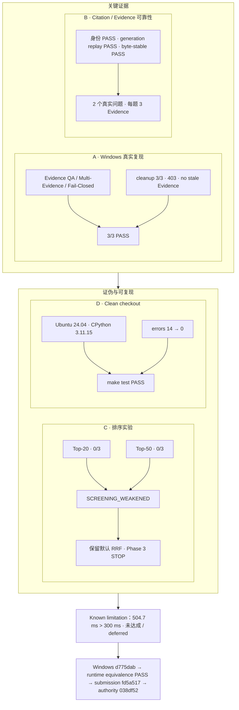

# 08-key-evaluation-results — 绘图规格

Spec ID：`08-key-evaluation-results`

用途：用少量高价值证据块说明验证、证伪和已知债务

性质：结果总览，不是完整 benchmark 表

共同证据账本：[`VISUAL_EVIDENCE_LEDGER.md`](VISUAL_EVIDENCE_LEDGER.md)

## 1. Figure objective

用四个证据块和一条限制栏说明：冻结 RAG baseline 由真实复现、引用/回放门禁、负向
排序实验决策和 clean-checkout CI 共同支撑，同时公开未达成的 300 ms 性能目标。

## 2. Audience takeaway

评委在 10 秒后应记住：**系统不是只展示有利指标：真实 Windows 三场景 3/3 通过，
无效 Reranker 方案被 0/3 结果否决，clean checkout 可复现，同时 504.7 ms 性能债被
明确保留。**

## 3. Canvas / hierarchy

- 画布：16:9 横向。
- 布局：上方 2×2 证据卡，下方一条全宽 Known Limitation 栏，再下一条窄谱系脚注。
- 阅读顺序：左上 A“真实复现” → 右上 B“Citation / Evidence” → 左下 C“负向实验决策”
  → 右下 D“可复现性” → 底部 E“已知限制”。
- 每张证据卡只允许 1 个主数字或主结论，细节不超过 4 行。
- “PASS”只用于已经通过的对应门禁；`SCREENING_WEAKENED` 与 `未达成` 不使用成功视觉语义。

## 4. Major groups

| Group ID | Exact group name | Role |
|---|---|---|
| G-R1 | A · Windows 真实复现 | 三个 Competition 场景和 cleanup/403 结果 |
| G-R2 | B · Citation / Evidence 可靠性 | 两个真实问题的身份验证与回放结果 |
| G-R3 | C · 排序实验：证伪后停止 | Top-20/Top-50 0/3 与保留默认 RRF 决策 |
| G-R4 | D · Clean-checkout 可复现性 | 精确提交、Ubuntu/Python 环境、make test 与 14→0 |
| G-R5 | E · Known limitation | 504.7 ms 对 300 ms 目标及阶段/Acceptance 边界 |
| G-R6 | 证据谱系 | 区分 Windows 复现源、submission head 和冻结权威 commit |

## 5. Nodes

| ID | Display label | Technical meaning | Importance | Parent group | Evidence |
|---|---|---|---|---|---|
| R01 | Windows 真实复现 | 用户在 Windows PowerShell 5.1 上执行版本化 Gate | primary | G-R1 | 08-E01 |
| R02 | 3 / 3 PASS | 三个冻结 Competition scenario 均通过 | primary metric | G-R1 | 08-E02 |
| R03 | Evidence QA · PASS | `COMP-QA-001` | proof | G-R1 | 08-E03 |
| R04 | Multi-Evidence Audit · PASS | `COMP-EVIDENCESET-001`；模式仍为 AUDIT_ONLY | proof | G-R1 | 08-E03 |
| R05 | Fail-Closed · PASS | `COMP-FAIL-CLOSED-001` | proof | G-R1 | 08-E03 |
| R06 | cleanup 3/3 · 403 · no stale Evidence | 删除后 cleanup、不可见性和失败关闭 | proof | G-R1 | 08-E06 |
| R07 | 2 个真实问题 COMPLETED | 两个真实学术问题均完成，且每题返回 3 Evidence | primary | G-R2 | 08-E04 |
| R08 | Citation / Evidence / 页码身份 PASS | 确定性身份和位置门禁通过 | proof | G-R2 | 08-E05 |
| R09 | generation replay PASS | 两个问题的生成回放门禁通过 | proof | G-R2 | 08-E05 |
| R10 | byte-stable replay PASS | 本次两个问题的字节稳定回放为 true | proof | G-R2 | 08-E05 |
| R11 | Fixed BGE Reranker · Top-20 | 冻结 3 个排序失败的现有固定 Reranker screening | experiment | G-R3 | 08-E07 |
| R12 | 0 / 3 bilateral Top-3 recovery | Top-20 未恢复任一冻结双侧 Top-3 案例 | negative metric | G-R3 | 08-E07 |
| R13 | Fixed BGE Reranker · Top-50 | 仅扩大相同 Reranker 的候选 exposure | experiment | G-R3 | 08-E08 |
| R14 | 0 / 3 bilateral Top-3 recovery | Top-50 仍未恢复任一案例 | negative metric | G-R3 | 08-E08 |
| R15 | SCREENING_WEAKENED | 对现有 fixed reranker family 和冻结失败集的决策 | decision | G-R3 | 08-E09 |
| R16 | 保留默认 RRF · Phase 3 STOP | 不采用该优化，不自动开始下一个实验 | decision | G-R3 | 08-E09 |
| R17 | GitHub clean checkout | 在精确 submission head 上运行 Core tests | primary | G-R4 | 08-E10, 08-E12 |
| R18 | Ubuntu 24.04 · CPython 3.11.15 | CI 运行环境 | evidence | G-R4 | 08-E10 |
| R19 | make test PASS | clean-checkout Core tests 终态 | primary metric | G-R4 | 08-E10 |
| R20 | clean-checkout errors 14 → 0 | 历史 runtime/path clean-checkout errors 清零 | evidence | G-R4 | 08-E11 |
| R21 | combined P95 ≈ 504.7 ms | Windows 分段 profile 的组合检索 P95 | limitation metric | G-R5 | 08-E14 |
| R22 | 目标 300 ms · 未达成 / deferred | 显式未清偿性能债 | primary limitation | G-R5 | 08-E14 |
| R23 | Phase 3 PARTIAL · Phase 4 PARTIAL/AUDIT_ONLY | 阶段边界未被 Competition freeze 改写 | limitation | G-R5 | 08-E15 |
| R24 | 800–1500 Acceptance 未完成 · 不声称 production ready | 正式独立验收与生产边界 | limitation | G-R5 | 08-E16 |
| R25 | Windows source · d775dab | Windows 真实复现的精确来源提交 | provenance | G-R6 | 08-E01, 08-E13 |
| R26 | submission head · fd5a517 | clean-checkout 和 submission repository head | provenance | G-R6 | 08-E12, 08-E13 |
| R27 | frozen authority · 038df52 | 本轮开始时冻结权威 closeout commit | provenance | G-R6 | 08-E13 |

## 6. Edges

此图不是端到端流程；边只表达“证据支撑决策”，不把四块误连成执行顺序。

| Source | Target | Label | Direction | Type |
|---|---|---|---|---|
| R03 | R02 | scenario result | bottom-to-top | primary |
| R04 | R02 | scenario result | bottom-to-top | primary |
| R05 | R02 | scenario result | bottom-to-top | primary |
| R06 | R05 | lifecycle proof | left-to-right | secondary |
| R08 | R07 | validated outputs | bottom-to-top | primary |
| R09 | R07 | replay proof | bottom-to-top | primary |
| R10 | R07 | replay proof | bottom-to-top | primary |
| R11 | R12 | screening result | top-to-bottom | secondary |
| R13 | R14 | screening result | top-to-bottom | secondary |
| R12 | R15 | evidence | left-to-right | primary |
| R14 | R15 | evidence | left-to-right | primary |
| R15 | R16 | decision | left-to-right | primary |
| R17 | R18 | ran on | top-to-bottom | secondary |
| R18 | R19 | result | top-to-bottom | primary |
| R20 | R19 | clean-checkout repair | left-to-right | secondary |
| R21 | R22 | compared with target | left-to-right | failure |
| R22 | R23 | boundary preserved | left-to-right | secondary |
| R23 | R24 | boundary preserved | left-to-right | secondary |
| R25 | R26 | runtime equivalence PASS | left-to-right | provenance |
| R26 | R27 | closeout authority | left-to-right | provenance |

## 7. Visual emphasis

- **Primary proof：** `3/3 PASS` 是全图最大数字，但必须紧邻三个场景名称，避免被误解为
  大规模 benchmark 通过率。
- **Reliability block：** 强调“2 个真实问题、每题 3 Evidence”和四个身份/回放 PASS；
  不发明准确率百分比。
- **Falsification block：** 两个 `0/3` 与 `SCREENING_WEAKENED` 使用中性/警示视觉语义；
  `保留默认 RRF` 是基于失败结果的工程决策，不是算法胜利口号。
- **Reproducibility block：** `make test PASS` 和 `14 → 0` 并列，但注明后者是
  clean-checkout runtime/path errors。
- **Limitation rail：** `504.7 ms > 300 ms` 必须全宽展示，且“未达成 / deferred”字号不
  小于数值说明。
- **Provenance：** 三个短 commit 以单独底栏串联，`Windows source` 只贴在 d775dab 上。

## 8. Text content

图内精确短文本如下：

```text
A · Windows 真实复现
3 / 3 PASS
Evidence QA · PASS
Multi-Evidence Audit · PASS
Fail-Closed · PASS
cleanup 3/3 · 403 · no stale Evidence

B · Citation / Evidence 可靠性
2 个真实问题 COMPLETED
每题 3 条 Evidence
Citation / Evidence / 页码身份 · PASS
generation replay · PASS
byte-stable replay · PASS

C · 排序实验：证伪后停止
Fixed BGE Reranker · Top-20
0 / 3 bilateral Top-3 recovery
Fixed BGE Reranker · Top-50
0 / 3 bilateral Top-3 recovery
SCREENING_WEAKENED
保留默认 RRF
Phase 3 optimization · STOP

D · Clean-checkout 可复现性
GitHub clean checkout
Ubuntu 24.04 · CPython 3.11.15
make test · PASS
clean-checkout errors 14 → 0

E · Known limitation
combined P95 ≈ 504.7 ms
目标 300 ms
未达成 / deferred
Phase 3 · PARTIAL / NO_PROMOTION
Phase 4 · PARTIAL / AUDIT_ONLY
800–1500 Acceptance 未完成
不声称 production ready

证据谱系
Windows source · d775dab
runtime equivalence · PASS
submission head · fd5a517
frozen authority · 038df52
```

## 9. Caption

**图 08｜冻结 baseline 的关键验证与负向决策。** Windows 真实复现的三个 Competition
场景全部通过，Citation/Evidence 身份、回放、cleanup/403 与 clean-checkout CI 均有独立
证据；同时，固定 BGE Reranker 的 Top-20/Top-50 screening 均为 0/3，因此保留默认
RRF 并停止 Phase 3 排序优化。组合 P95 约 504.7 ms，高于 300 ms 目标，明确记为未达成、
deferred。

## 10. Speaker notes

- 3/3 指恰好三个冻结 Competition 场景，不是 100% 泛化准确率。
- 两个真实问题都完成并各返回 3 Evidence；Citation/Evidence/页码身份和两类 replay 通过。
- 我们没有选择性保留“看起来先进”的 Reranker：Top-20 和 Top-50 都是 0/3，因而停止。
- clean-checkout 在精确 `fd5a517`、Ubuntu 24.04 / Python 3.11.15 上 `make test PASS`。
- 性能债没有隐藏：约 504.7 ms 高于 300 ms；Phase 3/4 和正式 Acceptance 仍未完成。

## 11. Claim boundary

演示者不得从本图推断或说出：

- “Windows 复现了 fd5a517”；Windows 复现源是 `d775dab`，`fd5a517` 是 submission head。
- “3/3 等于所有问题 100% 正确”；它只覆盖三个冻结场景。
- “byte-stable replay 是所有自然语言生成的永久保证”；它是本次两个真实问题的观测结果。
- “0/3 证明所有 Reranker 或所有 ranking 方法无效”；只削弱当前 fixed reranker family 在
  冻结失败集上的依据。
- “14→0 是全部产品缺陷清零”；它只指 clean-checkout runtime/path errors。
- “300 ms 已达成”“Phase 3/4 已完成”“正式 Acceptance 已完成”或“production ready”。

## 12. Structural draft



## 13. Evidence mapping

全部数字、PASS、决策和限制映射到共享账本 `08-E01`～`08-E16`。渲染时必须保持
`3/3` 的场景范围、两个 `0/3` 的冻结失败集范围、`14→0` 的 clean-checkout 限定以及
三提交谱系；任一限定缺失都会把证据强度夸大。
